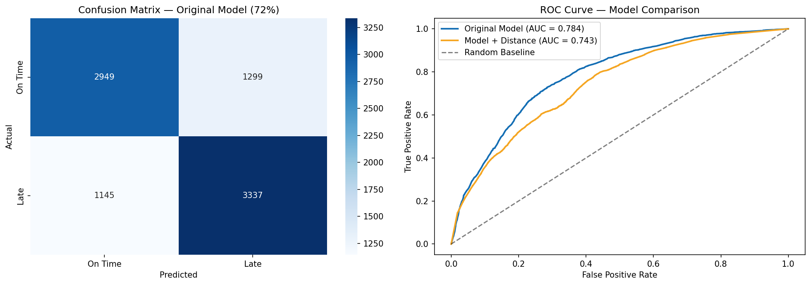

# Last-Mile Delivery Delay Analysis

## Motivation
Inspired by family members working as delivery drivers for Amazon and Walmart,
this project investigates what factors most influence last-mile delivery times
using a dataset of 43,000+ real delivery records.

## Key Findings
| Factor | Best Case | Worst Case | Difference |
|--------|-----------|------------|------------|
| Hour of Day | 8-10am (93 min) | 7-9pm (147 min) | +58% slower |
| Weather | Sunny (104 min) | Cloudy (138 min) | +33% slower |
| Traffic | Low (101 min) | Jam (148 min) | +46% slower |

## Model Performance
- **Algorithm:** Random Forest Classifier
- **Accuracy:** 72%
- **AUC Score:** 0.784
- Evening orders (7-9pm) carry **92% delay probability** vs **3%** for early morning

## Feature Engineering
Calculated delivery distance from raw GPS coordinates using geopy.
Discovered that corrupted location data (coordinates at 0,0) affected
3,651 rows (~8% of data), requiring careful cleaning before use.
Model comparison via ROC curve showed original model (AUC 0.784) outperformed
distance-added model (AUC 0.743), demonstrating that data quality impacts
can outweigh feature additions.

## Delay Risk Predictor
Built an interactive predictor function that estimates delay probability
given any combination of hour, weather, traffic, and area:

| Scenario | Delay Risk | Probability |
|----------|------------|-------------|
| 6am, Sunny, Low traffic | LOW | 3.1% |
| 1pm, Cloudy, High traffic | HIGH | 79.1% |
| 8pm, Fog, Jam traffic | HIGH | 92.2% |

## Tech Stack
- Python, Pandas, NumPy
- Scikit-learn (Random Forest, ROC/AUC)
- Matplotlib, Seaborn
- Geopy (distance calculation)

## Dataset
[Amazon Delivery Dataset](https://www.kaggle.com/datasets) — 43,739 records
