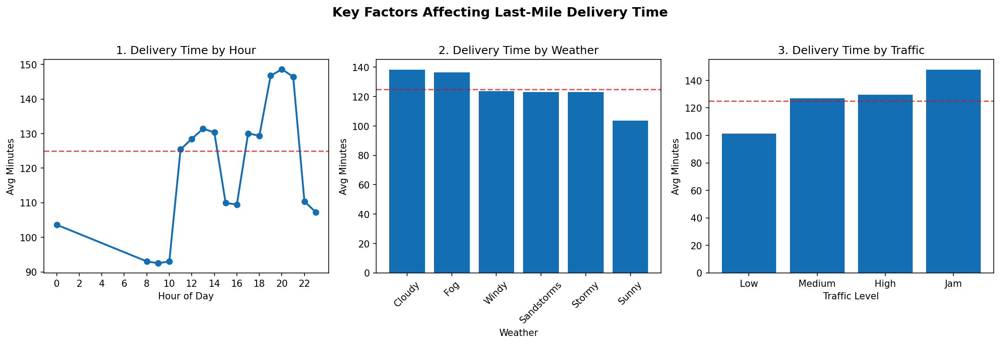

# Last-Mile Delivery Delay Analysis

## Motivation
Inspired by family members working as delivery drivers for Amazon and Walmart,
this project investigates what factors most influence last-mile delivery times
using a dataset of 43,000+ real delivery records.

## Key Findings
| Factor | Best Case | Worst Case | Difference |
|--------|-----------|------------|------------|
| Hour of Day | 8-10am (93 min) | 7-9pm (147 min) | +58% slower |
| Weather | Sunny (104 min) | Cloudy (138 min) | +33% slower |
| Traffic | Low (101 min) | Jam (148 min) | +46% slower |

## Model
A Random Forest Classifier trained on hour, weather, traffic, and area
achieved **72% accuracy** predicting whether a delivery will be delayed.

Top predictive features: Traffic level, Weather condition, Order hour.

## Tech Stack
- Python, Pandas, NumPy
- Scikit-learn (Random Forest)
- Matplotlib, Seaborn

## Dataset
[Amazon Delivery Dataset](https://www.kaggle.com/datasets) — 43,739 records# last-mile-delivery-analysis
